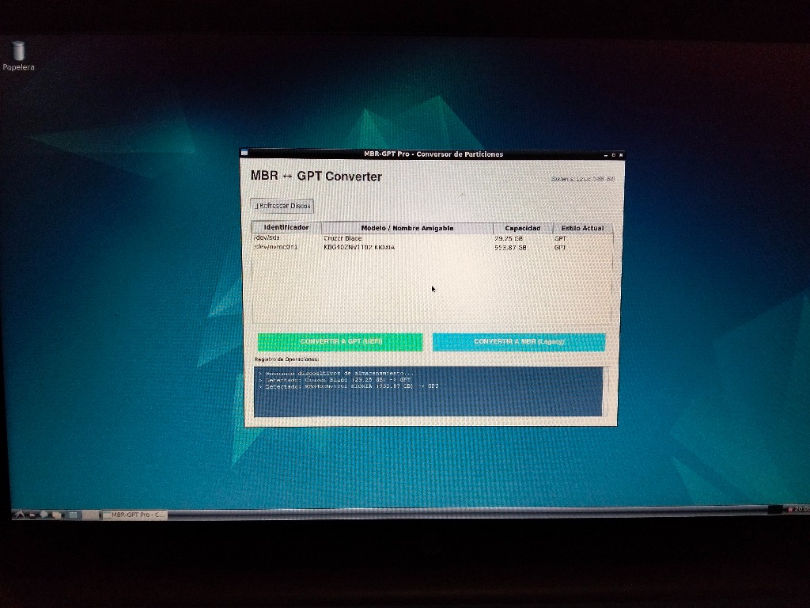
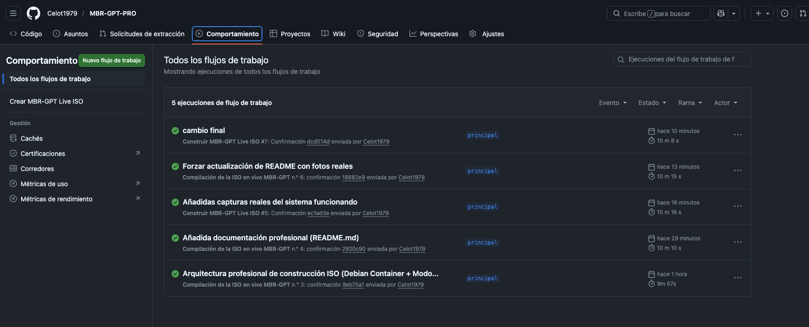
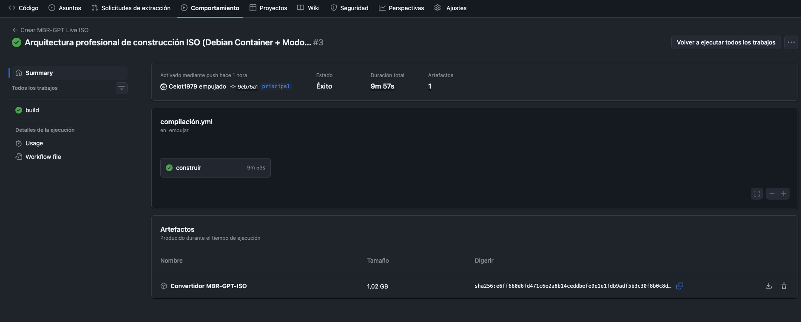
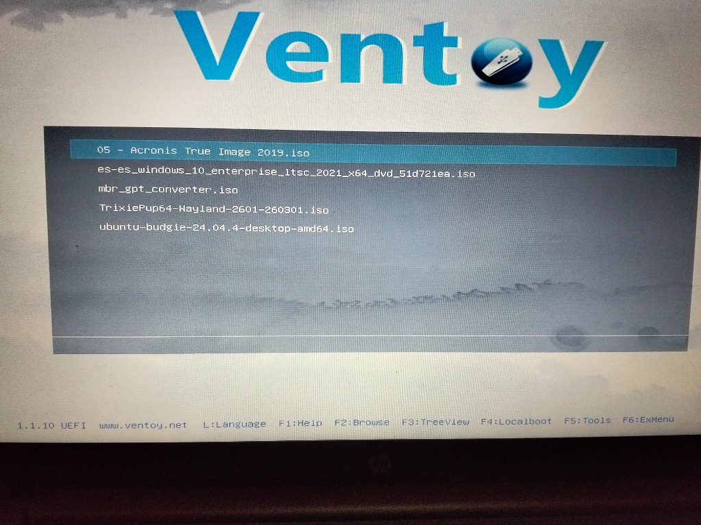
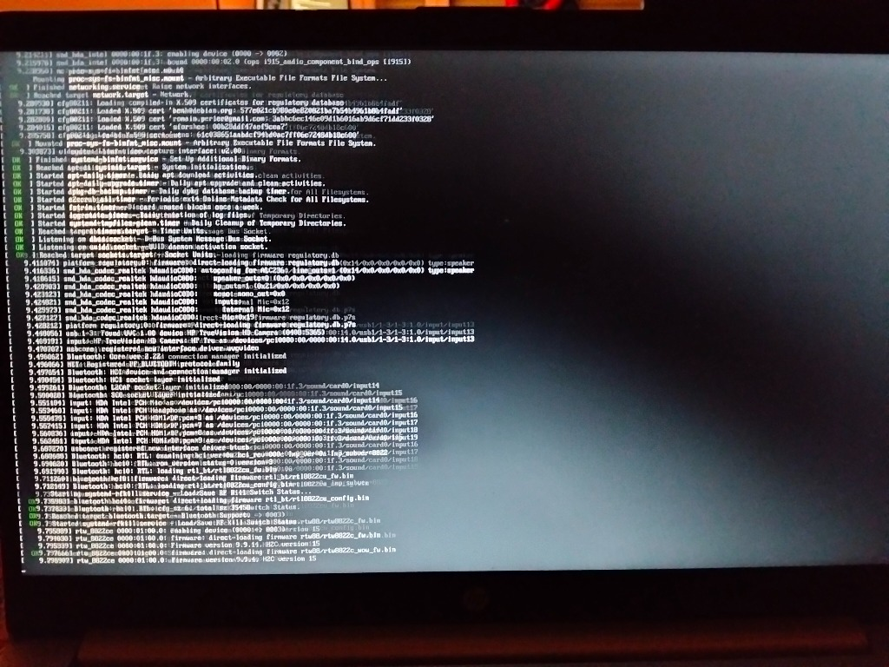
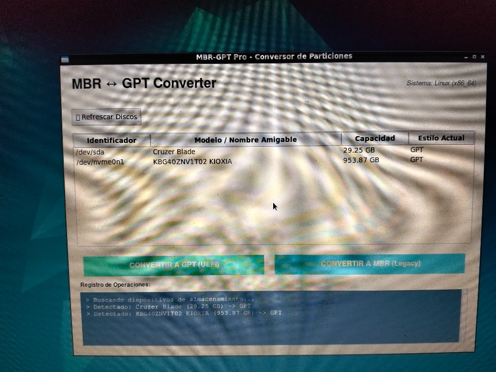

# 🛠️ MBR-GPT Pro: Conversor Universal de Particiones

**MBR-GPT Pro** es una herramienta técnica diseñada para la gestión segura y conversión de tablas de particiones entre formatos **MBR (Legacy)** y **GPT (UEFI)**. Creado para técnicos y estudiantes, permite trabajar desde sistemas operativos en ejecución o mediante una **ISO de Rescate Universal** compatible con Ventoy.

---

## 🚀 ¿Cómo usarlo en Ventoy? (Guía Rápida)

Si quieres usar esta herramienta en cualquier PC (incluso si no arranca), sigue estos pasos:

1.  **Descarga la ISO:** 
    *   Ve a la pestaña [Actions](https://github.com/Celot1979/MBR-GPT-PRO/actions) de este repositorio.
    
    *   Haz clic en la última construcción exitosa ✅.
    
    *   Descarga el archivo en la sección **Artifacts** y descomprime el `.zip`.
    
2.  **Copia a Ventoy:**
    *   Arrastra el archivo `mbr_gpt_converter.iso` a tu pendrive Ventoy.

3.  **Arranca el PC:**
    *   Inicia el ordenador desde el USB.
    *   Selecciona `MBR-GPT-Pro` y pulsa Enter.
    *   Verás la secuencia de carga de Linux y el programa se abrirá solo.

---

## 🧬 ¿Cómo se construyó este proyecto?

Este proyecto nació de la necesidad de tener una herramienta multiplataforma que no dependiera de costosas licencias de software propietario.

### Stack Tecnológico:
*   **Lenguaje:** Python 3 para la lógica y la interfaz.
*   **GUI:** Tkinter con diseño premium y centrado automático.
*   **Motor:** PowerShell (Windows) y GDisk/Parted (Linux).
*   **Live ISO:** Debian Bookworm + LXDE Desktop.
*   **Automatización:** GitHub Actions con Docker Privilegiado.

---

## 🛡️ ¿Es seguro? (Preguntas Frecuentes)

**¿Perderé mis datos al convertir?**
El programa utiliza métodos **no destructivos**. En la conversión de MBR a GPT, los datos se preservan al 100%. Para GPT a MBR, siempre que el disco tenga **4 particiones o menos**, la estructura se respeta. 

**¿Funciona en discos de sistema?**
Sí, especialmente desde la **ISO de Ventoy**, ya que el disco de Windows no está "en uso".

---

## ✍️ Autor
*   **Daniel Gil** - [Celot1979](https://github.com/Celot1979)

